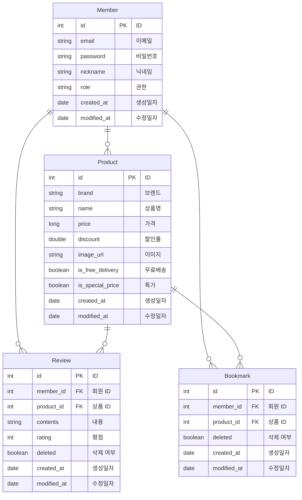

# 오늘의집 클론 서비스

> 항해99 4조 클론 서비스 프로젝트

## 👪 팀원
- [유재성](https://github.com/Peter-Yu-0402)
- [유하정](https://github.com/yuha00e)
- [김수환](https://github.com/openmpy)

## 🔧 구현 기능

- [x] 회원 가입 기능
    - 이메일, 닉네임 중복 검사 기능
- [x] 로그인 기능
    - Access Token 발행
    - Refresh Token 발행
- [x] Refresh Token 재발행 기능
- [x] 로그아웃 기능
- [x] 상품 기능
    - 오늘의집 상품 1시간 간격으로 크롤링 기능
    - 실시간 상품 TOP10 인기 검색어 기능
    - 상품 목록 페이징 기능
    - 선택 상품 조회 기능
    - 상품 검색 기능
- [x] 북마크 기능
    - 추가, 삭제, 조회 기능
    - 목록 페이징 기능
- [x] 리뷰 기능
    - 리뷰 CRUD 기능

## 📚 스택

- JDK 17
- Spring Boot 3.1.9
- Spring Boot JPA
- Spring Boot Validation
- Spring Boot Security
- Swagger UI
- JWT
- Elastic Beanstalk, EC2, RDS
- MySQL
- Redis
- Github Actions
- Selenium

## 🔖 ERD

## 📄 API 명세서

URL: http://hanghae-4.ap-northeast-2.elasticbeanstalk.com/swagger-ui/index.html

## 📐 시스템 아키텍처

